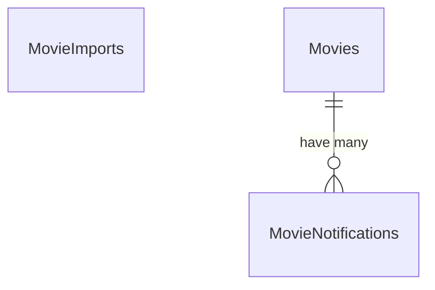
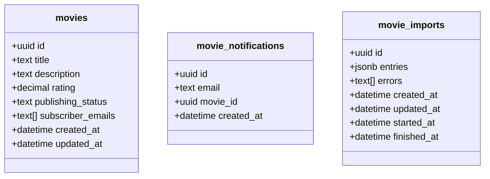

# Bulk Import Exercise

This repository serves as a starting point for an exercise in optimising bulk/batch imports.

The initial implementation is rudimentary in that it works, but it is not remotely optimised.

There are functional tests covering the behaviour to ensure your changes do not break anything and performance tests to benchmark the speed at which imports occur and the memory utilised. These tests are configured to trigger on Github Actions, therefore it should be straight-forward to clone/fork the repository, make your changes and measure the outcome.

If you open one of the [workflow runs in Github Actions](https://github.com/ryantownsend/bulk-import-exercise/actions/workflows/rubyonrails.yml), you'll see there's a summary of the performance and memory consumption of the API.

If you'd prefer to run the test suite locally, you can do so with RSpec (`bundle exec rspec`) and the performance and memory summary will be output to `tmp/summary.md` instead.

## Features

The application is a simple database containing movies and their ratings. Each movie can have emails associated with it that are notified when it's updated.

## Data Diagrams

### Entity Relationships

### Database Schema

